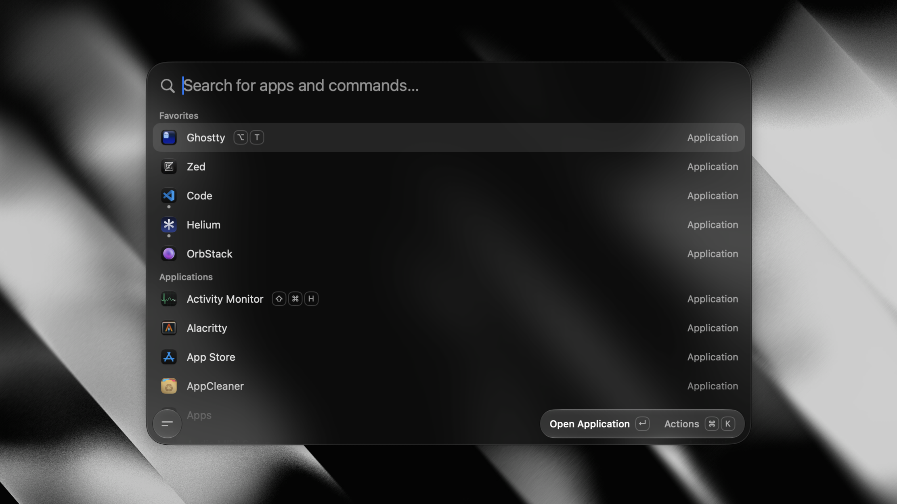

# Tinycast

**A tiny, fully native macOS launcher. One hotkey, everything you reach for all day, under 100 MB of
RAM.**

SwiftUI and AppKit, **zero third-party dependencies**, no Electron and no telemetry. It also **runs
real Raycast extensions**, rendered as native SwiftUI. Free, open source, and staying that way.

  

## Features

- **App launcher** — fuzzy-search and launch anything, pin favorites, see what's running, quit an app
  or every app at once.
- **Global hotkey** — one shortcut summons the palette from anywhere.
- **Per-app hotkeys** — bind a key to an app; press it to toggle (focus/hide).
- **Search Files** — open files and folders from the folders you choose, through Spotlight, with no
  index of our own.
- **Dictionary** — look a word up with the Define Word command, or define whatever you typed from the
  launcher's fallbacks, read from the Mac's own dictionaries.
- **Clipboard history** — text and images, searchable, pasted back into the app you were using.
- **Calculator** — do math, unit, live currency and crypto conversions inline, right in the palette.
- **Quicklinks** — turn a URL, search, file or deeplink into a command, with placeholders for typed
  input, the clipboard or the date.
- **Apple Shortcuts** — search and run the shortcuts you built in the Shortcuts app, with aliases and
  global hotkeys.
- **Snippets** — reusable Markdown templates with dynamic placeholders, arguments, nested references
  and optional keyword expansion.
- **Custom commands** — run named shell commands through fuzzy search or their own global hotkeys.
- **Window management** — 34 Rectangle-style actions: halves, quarters, thirds, sizing, nudging,
  display moves, fullscreen and Spaces.
- **System actions** — lock, sleep, restart, empty trash, toggle appearance, Bluetooth, mute, hidden
  files, and more.
- **Calendar and meetings** — your next meeting on the empty palette and in the menu bar, one key to
  join it, or let it join itself.
- **KeePass** — native database search through KeePassXC, with password/key-file unlocking,
  one-time codes, favorites and protected copy/paste.
- **Notes** — an unlimited collection of plain Markdown files in one floating editor, searchable from
  the palette and rendered as you write.
- **Emoji picker** — a searchable emoji grid, one keystroke away.
- **AI chat** — use your own key or an installed AI account: ask Quick AI from the palette, or keep
  longer conversations in the AI Chat window, with a searchable, pinnable history. Off out of the box,
  like every AI feature.
- **Quick Actions** — fix grammar, rewrite, translate or summarize the selected text in any app.
- **Raycast extensions** — run the ones you already have natively, rendered as SwiftUI.
- **Backup and import** — export your settings to a file, or import your setup from Raycast.

## Permissions

**Accessibility** — needed when Tinycast pastes or expands text into another app, and the only
permission snippet keyword expansion needs. You're prompted when you first use a feature that needs
it; grant access in **System Settings → Privacy & Security → Accessibility**. Snippets ship
disabled, and keystrokes are matched locally, never stored and never sent anywhere.

## Using it

1. Open **Settings → General** and record a global shortcut to summon Tinycast.
2. Press it anywhere → the palette floats in. Type to filter, **↵** to launch.
3. **Tab** switches between Apps and Clipboard; **↑/↓** move, **Esc** dismisses.
4. **Settings → Shortcuts** — search an app or custom command and record a global shortcut.
5. **Settings → Snippets** — enable the feature, then create templates with expansion keywords.

## Building from source

See **[docs/development.md](docs/development.md)** for the toolchain, build, packaging, release and
website workflows. **[docs/](docs/README.md)** indexes everything else — architecture, engineering
standards, the design system and one document per feature.

## Contributing

> [!IMPORTANT]
> **Open an issue before you write code — this is mandatory.** Get the bug or the feature agreed on
> first; discussing it in the issue is strongly
> encouraged. A PR that doesn't close an issue marked `approved` is closed automatically however good
> the patch is, and the work is wasted. Docs-only fixes are the one exception.
>
> Tinycast's feature set is deliberately closed, and "another launcher has it" is not a reason on its
> own. Ask whether a feature is wanted before you ask for it.

Read **[CONTRIBUTING.md](CONTRIBUTING.md)** first — it covers the memory budget every PR is held to,
the before/after video requirement for visual changes, and why features get declined. Every PR fills
in the **[pull request template](.github/PULL_REQUEST_TEMPLATE.md)**. Security issues go through
[SECURITY.md](SECURITY.md), not the issue tracker.

## Star History

<a href="https://www.star-history.com/?repos=abue-ammar%2Ftinycast&type=date&legend=top-left">
 <picture>
   <source media="(prefers-color-scheme: dark)" srcset="https://api.star-history.com/chart?repos=abue-ammar/tinycast&type=date&theme=dark&legend=top-left" />
   <source media="(prefers-color-scheme: light)" srcset="https://api.star-history.com/chart?repos=abue-ammar/tinycast&type=date&legend=top-left" />
   
 </picture>
</a>

## License

[AGPL-3.0](LICENSE)

This project is a fork of [Tinycast by abue-ammar](https://github.com/abue-ammar/tinycast).
